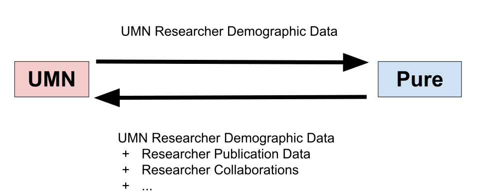
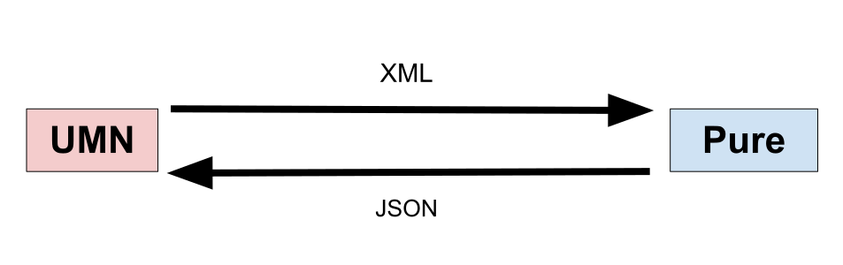
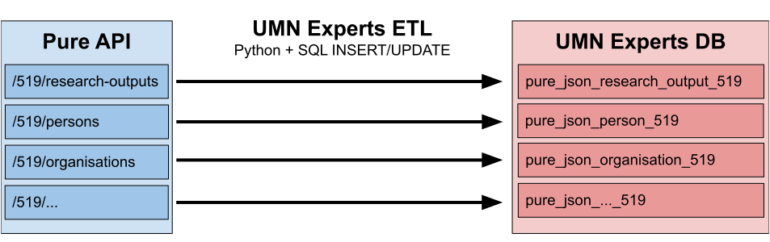

# Oracle JSON API

## UMN Code People

### April 1, 2021

David Naughton and Michael Berkowski

UMN Libraries Web Development
---
## Overview

How and why the UMN Libraries puts raw JSON records from a vendor into Oracle, 
and builds views to query them using the Oracle JSON API, instead of using a 
more traditional ETL approach, for the UMN-wide Experts@Minnesota project.

Slides: https://z.umn.edu/experts-oracle-json
---
## Experts@Minnesota

> [Experts@Minnesota](https://experts.umn.edu) is the research information
> management tool for the University of Minnesota. It uses University records
> and publication data harvested from Scopus to create public profiles for
> University of Minnesota faculty and researchers.

— https://libguides.umn.edu/experts-at-mn
---
## What Libraries WebDev does for Experts


vvv
### Data Types


---
## How?
---
## Oracle 19c JSON API Docs

[JSON Developer's Guide](https://docs.oracle.com/en/database/oracle/oracle-database/19/adjsn/)
vvv
### SODA

> [Simple Oracle Document Access (SODA)](https://docs.oracle.com/en/database/oracle/simple-oracle-document-access/)
> is a set of NoSQL-style APIs that let you create and store collections of documents
> (in particular JSON) in Oracle Database, retrieve them, and query them, without
> needing to know Structured Query Language (SQL) or how the documents are stored in the database.

We don't use it, but the SODA docs have given us important clues about things like
[indexing](https://docs.oracle.com/en/database/oracle/simple-oracle-document-access/adsdi/overview-soda-index-specifications.html#GUID-4848E6A0-58A7-44FD-8D6D-A033D0CCF9CB).
---
## Table Design

We also found the [SODA docs on Collection Metadata](https://docs.oracle.com/en/database/oracle/simple-oracle-document-access/adsdi/soda-collection-metadata-components-reference.html#GUID-49EFF3D3-9FAB-4DA6-BDE2-2650383566A3)
helpful in designing our JSON tables.
vvv
### Tables, Collections, and Naming

SODA expects each table to contain records from a single collection,
sharing a common schema. Because Pure has multiple collections, whose
schemas may change across API versions, we have many tables, all
following this naming convention:

`pure_json_{collection}_{api_version}`
vvv
### Table Structure

| Column | Type |
| ------ | ---- |
| UUID | VARCHAR2(36 CHAR) |
| INSERTED | DATE |
| UPDATED | DATE |
| PURE\_CREATED | DATE |
| PURE\_MODIFIED | DATE |
| JSON\_DOCUMENT | CLOB |
---
## Syncing

Example using Pure web services API version 5.19


vvv
### Syncing Deletions

No need to use `JSON_DOCUMENT` columns for syncing Pure and Experts DB,
except for `previousUuids`:

```sql
DELETE FROM pure_json_person_519
WHERE uuid IN (
  SELECT jt.previous_uuid
  FROM pure_json_person_519,
    json_table(
      json_document, '$'
      COLUMNS (
        uuid VARCHAR2(36) PATH '$.uuid',
        NESTED PATH '$.info.previousUuids[*]'
          COLUMNS (previous_uuid VARCHAR2(36) PATH '$')
      )
    ) AS jt
  WHERE json_exists(json_document, '$.info.previousUuids')
  AND jt.previous_uuid IS NOT NULL
)
```
---
## ETL vs ELT

Unlike a more traditional ETL approach, in which we would Extract and Transform
the data before Loading it, what we've described so far is ELT. We've Extracted
and Loaded JSON records, but we've done no Transforming.
---
## JSON API views

### A Transformation Proof-of-Concept

We have an application already using tables created via ETL, in which we
transform the data before loading, to prepare it for insertion into a
highly normalized relational schema.

Can we create views of the JSON records that replicate that schema?
---
## Problem: JSON views are slow!

All but narrowly filtered `SELECT`s are too slow to do in real time. You can
index inside JSON and query for one or many indexed records but querying the
whole table is far too slow.
vvv
### Solution: Materialized views

Refreshed on a specific schedule or on demand,
after loading JSON documents into the source tables.
vvv
### Create a materialized view
```sql
CREATE MATERIALIZED VIEW json_viewname
  BUILD DEFERRED
  REFRESH ON DEMAND
AS
SELECT...
```
---
## Use a JSON field in `SELECT`

The next couple of examples query JSON with this structure:

```json
{
  "pureId": 44308,
  "uuid": "03e07f55-bfac-4ae3-8c47-05b52fe4557e",
  "journalAssociation": {
    "title": {
      "value": "Biochemistry"
    },
    "issn": {
      "value": "0006-2960"
    }
  }
}
```
vvv
### Implicit joins with `JSON_TABLE()`

```sql
 SELECT
   t.uuid,
   jt.title,
   jt.issn
 FROM
   source_table t,
   -- Query into the root of the json document '$'
   -- Calling JSON_TABLE with no join conditions joins
   -- implicitly to the source table
   json_table(t.json_document, '$'
     COLUMNS(
       title PATH '$.journalAssociation.title.value',
       issn PATH '$.journalAssociation.issn.value',
     )
   ) jt
```
vvv
### Explicit joins with `JSON_TABLE()`
Use explicit joins when joining against additional tables besides the JSON doc's containing table.
```sql
SELECT
   t.uuid,
   jt.title,
   jt.issn,
   j_other.some_col
 FROM source_table t
   -- Use an explicit join when joining against other tables
   INNER JOIN json_table(t.json_document, '$'
     COLUMNS(
       title PATH '$.journalAssociation.title.value',
       issn PATH '$.journalAssociation.issn.value',
     )
   ) jt ON 1=1 -- Any true condition will do
   -- Additional joins
   LEFT OUTER JOIN t_other ON jt.issn = t_other.issn
```
---
## `NESTED PATH` queries

JSON containing an array collection:

```json
{ "uuid": "03e07f55-bfac-4ae3-8c47-05b52fe4557e",
  "externalIds": [
    { "idValue": "12667062",
      "idSource": "PubMed"
    },
    { "idValue": "0345269998",
      "idSource": "QABO"
    }
  ],
  "journalAssociation": {
    "title": { "value": "Biochemistry" }
  }
}
```
vvv
```sql
SELECT
  t.uuid,
  jt.title,
  jt.externalIdSource,
  jt.externalIdValue
FROM source_table t,
  json_table(t.json_document, '$'
     -- title is not part of the nested structure
     COLUMNS(
       title PATH '$.journalAssociation.title',
       -- Nest query for all array values [*]
       -- Syntax is the same as `JSON_TABLE()`
       NESTED PATH '$.externalIds[*]'
         COLUMNS(
           externalIdSource PATH '$.idSource',
           externalIdValue PATH '$.idValue'
         )      
     )
   ) jt
```
vvv
Produces multiple rows, one for each in the `externalIds[*]` array collection:

| uuid | title | externalIdSource | externalIdValue |
-------|-------|------------------|-----------------|
| 03e07f55-bfac-4ae3-8c47-05b52fe4557e | Biochemistry | PubMed | 2667062 |
| 03e07f55-bfac-4ae3-8c47-05b52fe4557e | Biochemistry | QABO | 0345269998 |
---
## Materialized View Caveats
- Potentially slow refresh speed
- Oracle may not permit multiple `JSON_TABLE()` joins or `UNION`s in one view,
  even if they work in a plain query or non-materialized view.
- Oracle may not permit multiple common table expressions (`WITH` clauses)
  when using `JSON_TABLE()`
- Work around these limits by creating multiple component views, then `JOIN` or
  `UNION` them together into your primary view
---
## Why?
---
### Pure API

- [Interactive Docs](https://experts.umn.edu/ws/api/519/api-docs/index.html#!)
- [JSON Schema](https://experts.umn.edu/ws/api/519/swagger.json)
vvv
#### Challenges

- Large, complex schema. Crashes the [official Swagger editor](https://editor.swagger.io/)!
- Elsevier releases a new version every ~6 months, often with bc-breaking schema changes.
- Syncing
  - `/changes` endpoint returns `CHANGE/DELETE/UPDATE`, record IDs, and versions, but no dates.
  - Collection records have created/modified dates, but no versions.
  - No way to filter `/changes`, and most deletes appear only there, unless...
  - ...the delete is the result of a merge, in which case the deleted record ID appears only
    in the `previousUuids` list of the record that survived the merge.
---
### First attempt: traditional ETL

Wrote code to extract from the Pure API only the fraction of data needed for a single
application, transform it, and load it into an [Oracle schema](https://github.com/UMNLibraries/experts_dw).
vvv
#### Problems

- Deeply hierarchical, variable, inconsistent JSON schema. Doesn't translate well to a relational schema.
- Complex schema and lots of code for very little data.
- Fragile code, largely due to rapidly changing JSON schema.
---
### Second attempt: Oracle JSON API

Original requirement, still unfulfilled: make _all_ Pure data available in a local
Oracle database, to ensure we will always have our own copy of the data, and to allow 
for joins with OIT Data Warehouse tables, for any future
applications or reporting people may want to create.
vvv
#### Oracle JSON API: solutions to the problems above?

Instead of traditional ETL...

- load raw JSON into Oracle, and
- create queries or views using Oracle JSON API for only the data people want to use.

Allows us to...

- avoid writing lots of fragile code to populate complex schemas no one is using,
- while still meeting the requirement that we have all the data.
---
### YMMV

Definitely not the best choice for every project.
