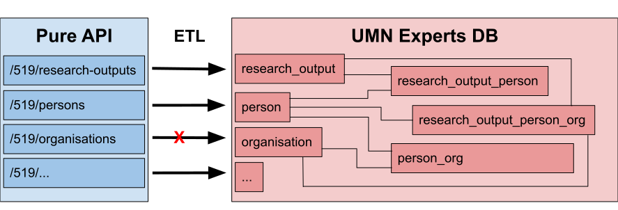
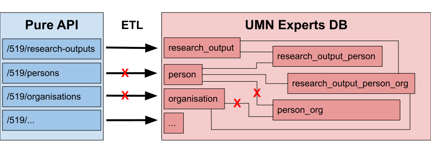
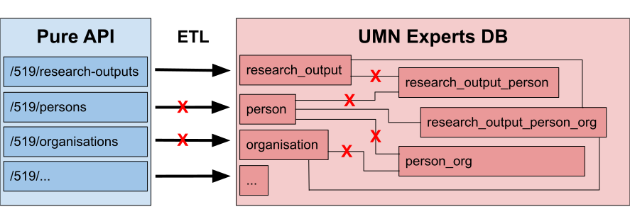
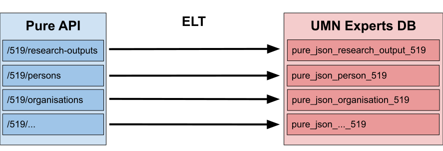

# Oracle JSON API

## UMN Code People

### April 1, 2021

David Naughton and Michael Berkowski

UMN Libraries Web Development
---
## Overview

How and why the UMN Libraries puts raw JSON records from a vendor into Oracle, 
and builds views to query them using the Oracle JSON API, instead of using a 
more traditional ETL approach, for the UMN-wide Experts@Minnesota project.

Slides: https://z.umn.edu/experts-oracle-json
---
## Experts@Minnesota

> [Experts@Minnesota](https://experts.umn.edu) is the research information
> management tool for the University of Minnesota. It uses University records
> and publication data harvested from Scopus to create public profiles for
> University of Minnesota faculty and researchers.

— https://libguides.umn.edu/experts-at-mn
---
## What Libraries WebDev does for Experts


vvv
### Data Types


---
## How?
---
## Oracle 19c JSON API Docs

[JSON Developer's Guide](https://docs.oracle.com/en/database/oracle/oracle-database/19/adjsn/)
vvv
### SODA

> [Simple Oracle Document Access (SODA)](https://docs.oracle.com/en/database/oracle/simple-oracle-document-access/)
> is a set of NoSQL-style APIs that let you create and store collections of documents
> (in particular JSON) in Oracle Database, retrieve them, and query them, without
> needing to know Structured Query Language (SQL) or how the documents are stored in the database.

We don't use it, but the SODA docs have given us important clues about things like
[indexing](https://docs.oracle.com/en/database/oracle/simple-oracle-document-access/adsdi/overview-soda-index-specifications.html#GUID-4848E6A0-58A7-44FD-8D6D-A033D0CCF9CB).
---
## Table Design

We also found the [SODA docs on Collection Metadata](https://docs.oracle.com/en/database/oracle/simple-oracle-document-access/adsdi/soda-collection-metadata-components-reference.html#GUID-49EFF3D3-9FAB-4DA6-BDE2-2650383566A3)
helpful in designing our JSON tables.
vvv
### Tables, Collections, and Naming

SODA expects each table to contain records from a single collection,
sharing a common schema. Because Pure has multiple collections, whose
schemas may change across API versions, we have many tables, all
following this naming convention:

`pure_json_{collection}_{api_version}`
vvv
### Table Structure

| Column | Type |
| ------ | ---- |
| UUID | VARCHAR2(36 CHAR) |
| INSERTED | DATE |
| UPDATED | DATE |
| PURE\_CREATED | DATE |
| PURE\_MODIFIED | DATE |
| JSON\_DOCUMENT | CLOB |
---
## Syncing

Example using Pure web services API version 5.19


vvv
### Syncing Deletions

No need to use `JSON_DOCUMENT` columns for syncing Pure and Experts DB,
except for `previousUuids`:

```sql
DELETE FROM pure_json_person_519
WHERE uuid IN (
  SELECT jt.previous_uuid
  FROM pure_json_person_519,
    json_table(
      json_document, '$'
      COLUMNS (
        uuid VARCHAR2(36) PATH '$.uuid',
        NESTED PATH '$.info.previousUuids[*]'
          COLUMNS (previous_uuid VARCHAR2(36) PATH '$')
      )
    ) AS jt
  WHERE json_exists(json_document, '$.info.previousUuids')
  AND jt.previous_uuid IS NOT NULL
)
```
---
## ETL vs ELT

Unlike a more traditional ETL approach, in which we would Extract and Transform
the data before Loading it into a normalized schema, what we've described so far
is ELT. We've Extracted and Loaded JSON records, but we've done no Transforming.
---
## JSON API Views

### A Transformation Proof-of-Concept

We have an application already using tables created for ETL, in which we
transform the data before loading, to prepare it for insertion into a
highly normalized relational schema.

Can we create views of the JSON records that replicate that schema?
---
## Problem: JSON views are slow!

All but narrowly filtered `SELECT`s are too slow to do in real time. You can
index inside JSON and query for one or many indexed records but querying the
whole table is far too slow.
vvv
### Solution: Materialized Views

Refreshed on a specific schedule or on demand,
after loading JSON documents into the source tables.
vvv
### Create a materialized view
```sql
CREATE MATERIALIZED VIEW json_viewname
  BUILD DEFERRED
  REFRESH ON DEMAND
AS
SELECT...
```
---
## Use a JSON field in `SELECT`

The next couple of examples query JSON with this structure:

```json
{
  "pureId": 44308,
  "uuid": "03e07f55-bfac-4ae3-8c47-05b52fe4557e",
  "journalAssociation": {
    "title": {
      "value": "Biochemistry"
    },
    "issn": {
      "value": "0006-2960"
    }
  }
}
```
vvv
### Implicit joins with `JSON_TABLE()`

```sql
 SELECT
   t.uuid,
   jt.title,
   jt.issn
 FROM
   source_table t,
   -- Query into the root of the json document '$'
   -- Calling JSON_TABLE with no join conditions joins
   -- implicitly to the source table
   json_table(t.json_document, '$'
     COLUMNS(
       title PATH '$.journalAssociation.title.value',
       issn PATH '$.journalAssociation.issn.value',
     )
   ) jt
```
vvv
### Explicit joins with `JSON_TABLE()`
Use explicit joins when joining against additional tables besides the JSON doc's containing table.
```sql
SELECT
   t.uuid,
   jt.title,
   jt.issn,
   j_other.some_col
 FROM source_table t
   -- Use an explicit join when joining against other tables
   INNER JOIN json_table(t.json_document, '$'
     COLUMNS(
       title PATH '$.journalAssociation.title.value',
       issn PATH '$.journalAssociation.issn.value',
     )
   ) jt ON 1=1 -- Any true condition will do
   -- Additional joins
   LEFT OUTER JOIN t_other ON jt.issn = t_other.issn
```
---
## `NESTED PATH` queries

JSON containing an array collection:

```json
{ "uuid": "03e07f55-bfac-4ae3-8c47-05b52fe4557e",
  "externalIds": [
    { "idValue": "12667062",
      "idSource": "PubMed"
    },
    { "idValue": "0345269998",
      "idSource": "QABO"
    }
  ],
  "journalAssociation": {
    "title": { "value": "Biochemistry" }
  }
}
```
vvv
```sql
SELECT t.uuid, jt.title, jt.externalIdSource, jt.externalIdValue
FROM source_table t,
  json_table(t.json_document, '$'
     -- title is not part of the nested structure
     COLUMNS(
       title PATH '$.journalAssociation.title',
       -- Nest query for all array values [*]
       -- Syntax is the same as `JSON_TABLE()`
       NESTED PATH '$.externalIds[*]'
         COLUMNS(
           externalIdSource PATH '$.idSource',
           externalIdValue PATH '$.idValue'
         )      
     )
   ) jt
```
vvv
Produces multiple rows, one for each in the `externalIds[*]` array collection:

| uuid | title | externalIdSource | externalIdValue |
-------|-------|------------------|-----------------|
| 03e07f55-bfac-4ae3-8c47-05b52fe4557e | Biochemistry | PubMed | 2667062 |
| 03e07f55-bfac-4ae3-8c47-05b52fe4557e | Biochemistry | QABO | 0345269998 |
---
## Materialized View Caveats
- Potentially slow refresh speed.
- Oracle may not permit multiple `JSON_TABLE()` joins or `UNION`s in one view,
  even if they work in a plain query or non-materialized view.
- Oracle may not permit multiple common table expressions (`WITH` clauses)
  when using `JSON_TABLE()`.
- Work around these limits by creating multiple component views, then `JOIN` or
  `UNION` them together into your primary view.
---
## JSON API Caveats

- Can't just use plain ol' SQL to write queries.
- Unfamiliar to most developers.
- Proprietary to Oracle.
---
## Why?
---
## Experts Req^H^H^H Wishes

- Traditional relational schema for _one_ user application, but also...
- ...load _all_ Pure data!
- "If you build it, they will come."
---
## Pure Data
vvv
### Collections/Record Types

| | Collections | |
| --- | --- | --- |
|datasets              |concepts                   |persons|
|activities            |fingerprints               |press-media|
|author-collaborations |semantic-groups            |prizes|
|changes               |thesauri                   |publishers|
|classification-schemes|impacts                    |research-outputs|
|ddp                   |journals                   |applications|
|downloads             |keyword-group-configuration|awards|
|equipments            |metadata                   |projects|
|events                |organisational-units       |external-persons|
vvv
### JSON Schema

[Pure API 5.19 Schema](pure-api-519-schema.json)

- Crashes the [official Swagger editor](https://editor.swagger.io/)!
- May change with each Pure API version, released every 4 months.
---
## Minimal Use So Far

- One external customer, using only a tiny fraction of the data.
- We _may_ have a second, internal customer, any day now!
  - (Wish we had more users, actually, because the data is really cool.)
---
## ETL Caveats
---
## Referential Integrity is Fragile

Hyper-simplified picture, but illustrates the complexity of relationships
inherent in loading only a fraction of Pure data into a normalized schema.


vvv
### What if we're missing an org record?


vvv
### Can't link persons to that org...


vvv
### ...which breaks loading of those person records.


vvv
### Now we can't link research outputs to those persons!


vvv
### Everything breaks!!!


vvv
### ELT Dramatically Simplifies Loading

By making Loading prior to and independent of Transforming, ELT has far fewer
moving parts, far fewer things that can break.


---
## The Biggest ETL Caveat

### Loading depends on successful Transforming. 

The more complex, deeply
hierarchical, and cross-referenced the source records, and the more such record
types, the more effort required to Transform those records into a normalized
relational schema, and the more fragile that schema will be.
---
## ETL Dilemma

What if we don't have many users yet?

- If we Transform _all_ the data, we may expend tremendous effort to build
  something few, if any, people will ever use.
- If we Transform only some of the data, _which_ data? Without users, how
  do we know what they want/need?
---
## ELT Benefits

### Loading is independent of Transforming.

- Much easier and faster to meet the "load all data" requirement.
- Allows for multiple views of the data, for different applications.
- Easier to version source record tables, which allows us to develop
  views using new versions while users query already existing views.
- Storing original records makes for easier bug-finding/fixing.
- If JSON-API-based views don't work for some application, we can still
  transform the original records in a more tradtional way.
---
## The Biggest ELT Benefit

### Lazy-loading Development

- Transform only what users ask for, if and when they ask for it.
- "If they come, we will build it."
---
## ELT > ETL
---
## YMMV
---
## Resources

### [Experts@Minnesota](https://experts.umn.edu)

### Oracle JSON API

- [JSON Developer's Guide - 19c](https://docs.oracle.com/en/database/oracle/oracle-database/19/adjsn/)
- [Simple Oracle Document Access (SODA)](https://docs.oracle.com/en/database/oracle/simple-oracle-document-access/)

### Pure 5.20 API

- [Interactive Docs](https://experts.umn.edu/ws/api/520/api-docs/index.html#!)
- [JSON Schema](https://experts.umn.edu/ws/api/520/swagger.json)
---
## Thank you!
